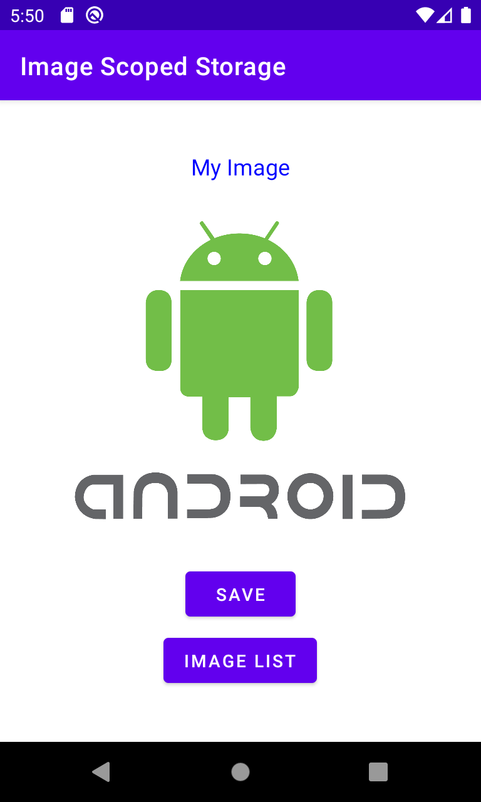
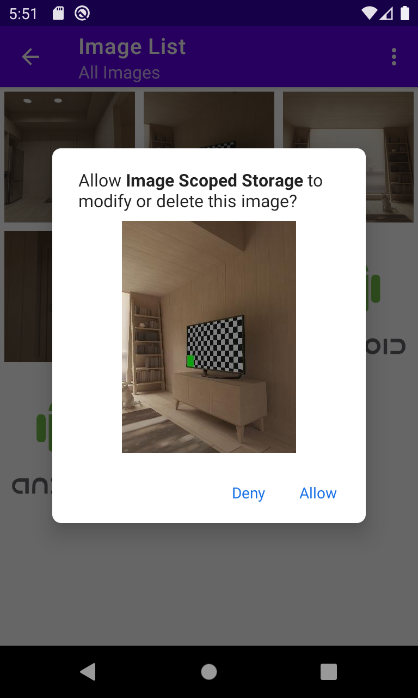
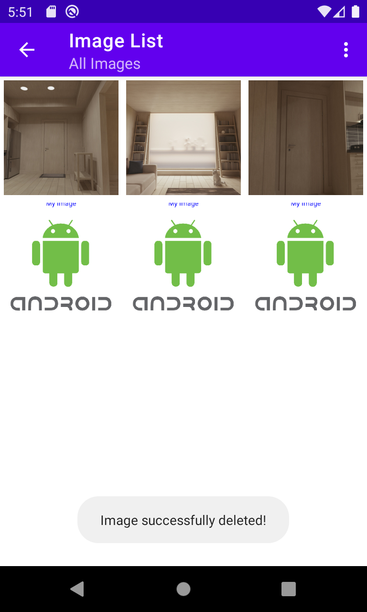

# Sobre o projeto

A partir do Android 10 (Q), o acesso amplo a todos os arquivos em qualquer pasta foi limitado. Com o **scoped storage (armazenamento com escopo)**, o Android limitou a forma como os desenvolvedores lidam com arquivos, dando mais segurança aos usuários. Um app que apenas grava áudios, por exemplo, não precisa de amplo acesso a todos os arquivos do usuário, podendo ter um escopo definido para salvar e obter seus áudios.

Este projeto visa o uso do armazenamento com escopo em imagens, utilizando as APIs [MediaStore](https://developer.android.com/reference/android/provider/MediaStore) para *criar, listar e excluir* imagens. O processo é parecido com outras mídias que podem ser acessadas com a MediaStore, como vídeos e áudios.

Uma pasta específica para as imagens geradas pelo app será criada em **Pictures/** com o nome **My App**. O app apenas converte um layout para Bitmap e posteriormente salva como uma imagem PNG em ***Pictures/My App***, mas a função de salvar imagem pode ser modificada para obter o Bitmap de outros casos, como uma imagem carregada da web, por exemplo.

  
  
  
  

## Exclusão de imagens

Para as imagens que foram geradas pelo app em ***Pictures/My App***, a exclusão será feita da mesma maneira em todas as versões do Android, mesmo no Android 10+. Porém, caso a imagem tenha sido criada por outro app, ***a partir do Android 10 é necessário ter a confirmação manual do usuário*** para que a imagem seja excluída.
Se o usuário reinstalar o app ou apagar os seus dados, as imagens anteriormente criadas por ele perderão o acesso livre para exclusão e o usuário terá que confirmar manualmente também.

No Android 10 é preciso fazer um trabalho a mais para verificar se a imagem foi realmente excluída, mas isso foi "corrigido" no Android 11.

## Utilizações:

[Glide](https://github.com/bumptech/glide): para o carregamento de imagens.  
[Coroutines](https://developer.android.com/kotlin/coroutines): para as operações de I/O fora da main thread.
